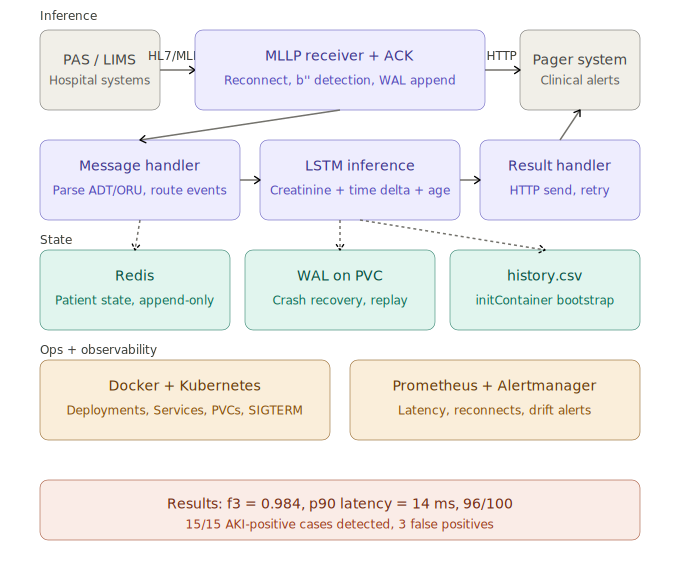
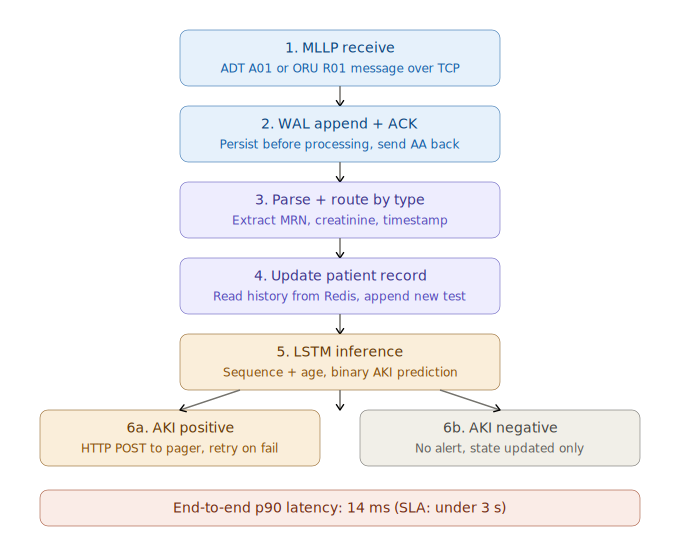
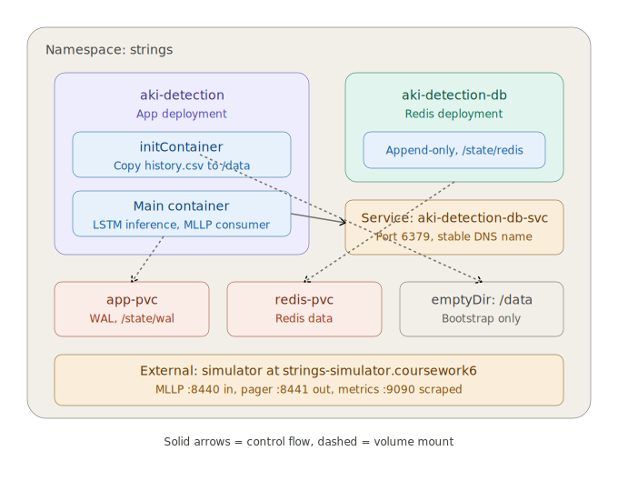
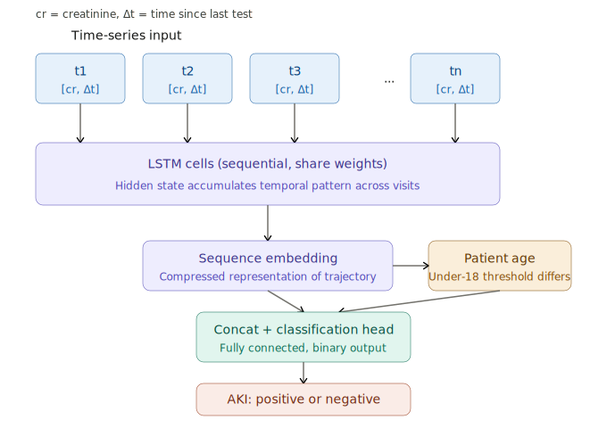

# Real-Time Acute Kidney Injury Prediction System

An end-to-end ML system that ingests real-time HL7/MLLP hospital messages, predicts Acute Kidney Injury from patient creatinine trajectories using an LSTM model, and dispatches clinical pager alerts — deployed on Kubernetes with full observability and crash recovery.

---

## Results

| Metric | Value |
|--------|-------|
| **f3 score** | **0.984** (NHS baseline: 0.85) |
| **p90 inference latency** | **14 ms** (SLA: < 3 s) |
| Scenario validation | 15 / 15 AKI-positive cases detected |

---

## System Architecture

A five-layer design: HL7/MLLP input, LSTM-based inference, Redis + WAL state management, Kubernetes operations, and Prometheus observability.

---

## Message Lifecycle

Each HL7 message flows from MLLP receive to pager alert in six steps, with state persisted before processing.

---

## Kubernetes Deployment

App and Redis deployments in the `strings` namespace, with volumes separated by lifecycle (PVC for durable state, emptyDir for bootstrap data).

---

## LSTM Model

Sequential `[creatinine, time_delta]` pairs feed into LSTM cells; the resulting embedding is concatenated with patient age before binary classification.

---

## Incident & Postmortem

A real production-style incident: an Azure node upgrade triggered a stale-connection bug where `recv()` returned empty byte strings on graceful TCP close. Detected via Alertmanager, mitigated via pod restart, and prevented through expanded integration tests covering simulator restart scenarios.

---

## Acknowledgements

This repository is a personal documentation summary of a 4-person team 
project originally developed on Imperial College London's GitLab. Source code remains in the original course 
repository; this version documents the system architecture and outcomes 
for portfolio purposes.

Simulator and evaluation infrastructure were provided by the course team.
